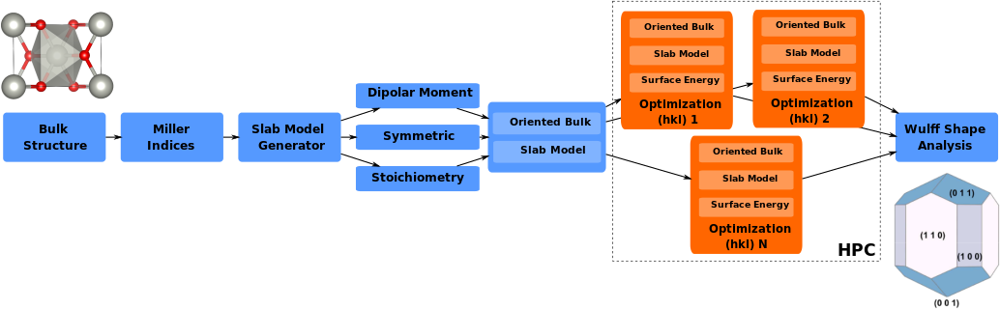

# MO Wulff Workflow

A starting point for a general Metal oxide Surfaces Workflow able to build the Wulff construction from DFT calculations automatized by Pymatgen, FireWorks and Atomate.

# Goals

The goal of this repository is to make accessible the code to everyone in group and
improve it in a collaborative way. Hopefully, ending on a great tool for many applications
in our group and more.

# General ToDo List

- [x] Metal oxide surfaces as non-dipolar, symmetric and Stoichiometric
- [x] Optimize both oriented bulk + slab model (VASP)
- [x] Surface Energy task after optimization
- [x] Wulff shape Analysis (as separeted Task)
- [ ] Metal oxide surfaces with dipolar moment?
- [x] Basic rotational DoF for OH and OOH (not generalized for other molecules yet).
- [ ] Non-stoichiometric slab models (Terminations) + gamma_hkl (with chemical potential)
- [ ] Include GGA+U method
- [ ] Single point calculation with hybrid DFT Functional
- [ ] **IDEA:** Function that its able to convert vasprun.xml to ASE-Trajectories?

