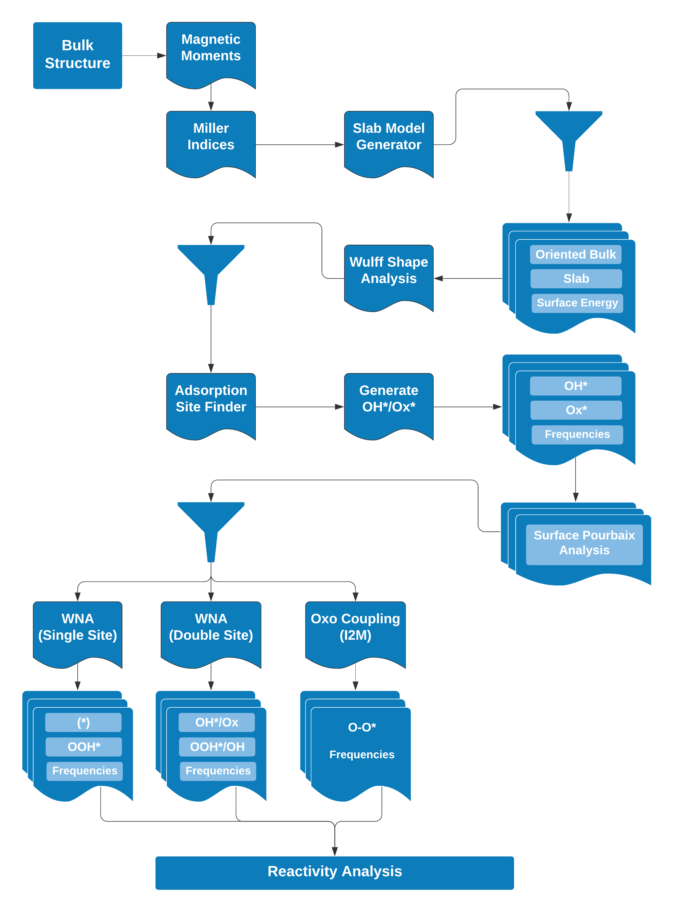

# MO Wulff Workflow

A starting point for a general Metal oxide Surfaces Workflow able to build the Wulff construction from DFT calculations automatized by Pymatgen, FireWorks and Atomate.

# Goals

The goal of this repository is to make accessible the code to everyone in group and
improve it in a collaborative way. Hopefully, ending on a great tool for many applications
in our group and more.

# Javi ToDo List

- [x] Metal oxide surfaces as non-dipolar, symmetric and Stoichiometric
- [x] Optimize both oriented bulk + slab model (VASP)
- [x] Surface Energy task after optimization
- [x] Wulff shape Analysis (as separeted Task)
- [x] Decorate bulk structure with magnetic moments (MAGMOM) based on crystal field theory
- [x] Bulk magnetic orders (NM, AFM, FM)
	- [x] Enumerate and decorate bulk structure with magmom and orderings
	- [x] General implementation of Optimization + Deformation + EOS_fitting for each magnetic order
	- [ ] Bulk Stability Analysis (after single-point)
- [ ] Single point calculation with hybrid DFT Functional
- [ ] FrequenciesFW and ThermoCorrections
- [ ] Surface Pourbaix Diagram Analysis
- [ ] Reactivity OER (WNA - Single site)

# Richard ToDo List

- [x] Basic rotational DoF for OH and OOH (not generalized for other 85 molecules yet).
- [ ] Metal oxide surfaces with dipolar moment (oc21-dataset)
- [ ] Non-stoichiometric slab models (Terminations) + gamma_hkl (with chemical potential)
- [ ] Include GGA+U method
- [ ] **IDEA** Include defects in slabs

# Yuri ToDo List

- [x] Generate unique hashes to identify/query jobs in database
- [x] Look into passing job info from parent to child fireworks
- [x] Add ContinueOptimizeFW to refactor branch
- [x] Transfer of magnetic moments across parents to childs
- [ ] WAVECAR (copy, delete, gzip) across parents to childs
- [ ] WAVECAR Transfer across different filesystems
- [ ] Add compatibility with 2 nodes

# Yuri/Javi ToDo List

- [x] Clean-up code for ADS_SLAB generation and add to refactor
- [x] Refactor branch merging with kubernetes_test
- [ ] Benchmark RuO2 and IrO2
- [ ] PARSING ERROR!!!!!
- [ ] Get vasp ouputs for fake_vasp
