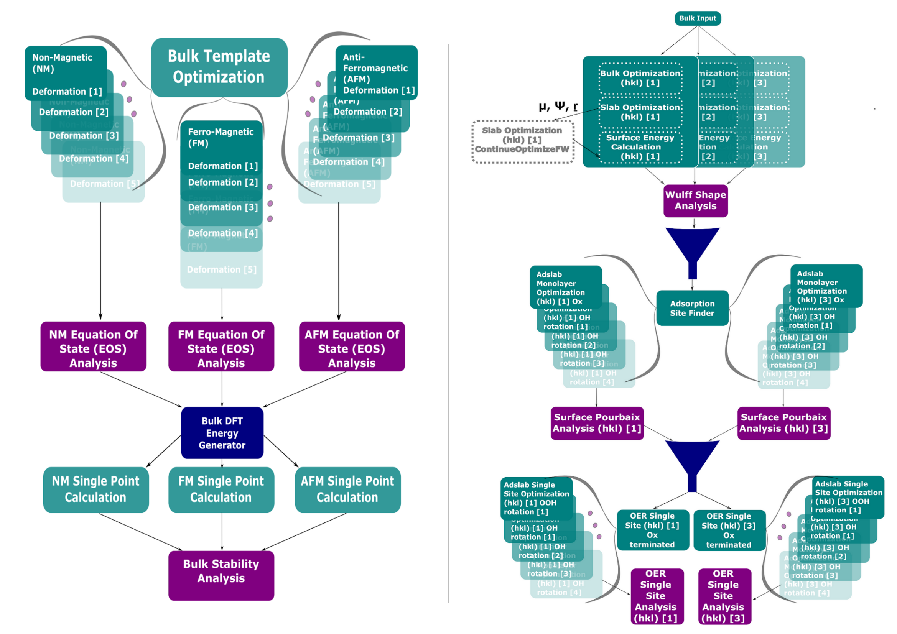

<h1 align="center"> <br/> WhereWulff <br/></h1>

[](https://github.com/ulissigroup/mo-wulff-workflow/actions/workflows/WhereWulff.yml)

## Introduction

`WhereWulff` couples deep expertise in Quantum Chemistry and Catalysis with that in workflow engineering, an approach that is slowly gaining traction in the science community [[1]](#1). While the advent of massively parallel computing clusters has given rise to a novel way of
searching chemical space in a high-throughput manner, we argue that as long as scientists are not
equipped with proper software best practices, self-actualization, even when coupled with years of
chemical intuition and heavy compute, is limited. In addition to tackling scientific challenges, we expect our open-source
workflow to serve a didactic purpose, democratizing access to complex material science pipelines
for those in the likes of experimentalists, who would like to corroborate or guide their endeavors
but don’t have the formal theoretical and computational training to do it from scratch. Finally, we encourage the scientific community to tap into `WhereWulff's` modularity in order to plug in other reactivities they might have domain expertise or interest in.

<figure align="center">
	
	<figcaption>
		<p><b>Figure 1.</b> WhereWulff general schema that consists in the bulk workflow to get the
		equilibrium bulk structure with the most stable magnetic configuration as NM, AFM or FM (Left), and the reactivity workflow that analyzes Wulff Construction, Surface Pourbaix diagram and OER Reactivity for a given material (Right).
		</p>
	</figcaption>
</figure>

As is common practice in the software realm, we leverage pre-existing open-source software packages with the most noteworthy ones being [Atomate](#2), [FireWorks](#3), [Custodian](#4) and [Pymatgen](#4) in order to deliver `WhereWulff`, which is itself open-sourced. This workflow conducts Density Functional Theory (DFT) calculations using the `Vienna Ab-initio Simulation Package` ([VASP](#5)).

## Installation

After installing [conda](http://conda.pydata.org/), run the following commands to create a new [environment](https://conda.io/docs/user-guide/tasks/manage-environments.html) named wherewulff and install dependencies.

```bash
conda env create -f wherewulff_env.yml
conda activate wherewulff
pip install -e .
```

`WhereWulff` main dependencies are [FireWorks](https://materialsproject.github.io/fireworks/), [Atomate](https://atomate.org) and [Pymatgen](https://pymatgen.org), that need further installation steps.

### FireWorks and Atomate

We refer the user to the [Atomate](https://atomate.org/installation.html) installation documentation to have a deeper explanation on how to set-up `FireWorks/Atomate` properly.

### Pymatgen

[Pymatgen](https://pymatgen.org) needs the `.pmgrc.yml` file to be configured with the VASP pseudopotentials, default DFT functional and the [Materials Project]() API token as:

To configure Pymatgen to find the VASP pseudopotential see [POTCAR setup](https://pymatgen.org/installation.html#)

```bash
pmg config -p <EXTRACTED_VASP_POTCAR> <MY_PSP>
pmg config --add PMG_VASP_PSP_DIR <MY_PSP>
pmg config --add PMG_DEFAULT_FUNCTIONAL PBE_54
```

Is always good practice to test if Pymatgen is able to find a given POTCAR file. The following command should create a new POTCAR file for H atom:

```bash
pmg potcar -s H -f PBE_54
```

Don't forget to include your `PMG_MAPI_KEY` to be able to run the Stability Analysis at the end of the Bulk Workflow.

Your `.pmgrc.yml` file should look like:
```bash
PMG_DEFAULT_FUNCTIONAL: PBE_54
PMG_MAPI_KEY: "YOUR_API_TOKEN"
PMG_VASP_PSP_DIR: "POTCAR_DIR"
```

## Run the Workflow

The following example is how to load the Bulk Workflow to the launchpad and then submitting how to submit it through the FireWorks command line:

```python
from WhereWulff.launchers.bulkflows import BulkFlows

# CIF file pathway
cif_file = "<<YOUR_CIF_FILE>>"

# BulkFlow method and config
bulk_flow = BulkFlows(bulk_structure=cif_file,
		n_deformations=21,
		nm_magmom_buffer=0.6,
		conventional_standard=True)

# Get Launchpad
launchpad = bulk_flow.submit(
    hostname="localhost",
    db_name="<<DB-NAME>>",
    port="<<DB-PORT>>",
    username="<<DB-USERNAME>>",
    password="<<DB-PASSWORD>>",
)
```

The Bulk workflow is called through the BulkFlow method which is able to submit the workflow to the launchpad for a given `CIF` file consisting in a bulk structure of a metal or metal oxide material.

The user needs to provide the `CIF` file pathway and the configure the workflow in terms of number of deformations for the `EOS` (Equation of States), the magnetic buffer for non-magnetic species included in the given material and whether to transform the given structure to conventional standrad.

The submit method inside BulkFlows class needs the MongoDB configuration features such as `hostname`, `db_name`, `port`, `username` and `password`. We encourage the user to not make public this information.

We encourage the user to use `Fireworks webgui` to make sure the workflow is properly added to the launchpad. Finally the way to run the workflow through the command line shell is as follows (-m flag is for maximum 5 jobs running in parallel): 

```bash
qlaunch rapidfire -m 5
```

The surface chemistry workflow is called through the SlabFlows method which is able to submit the whole worklfow to the launchpad for a given `CIF` file consisting in a bulk structure.

```python
from WhereWulff.launchers.slabflows import SlabFlows

# CIF file pathway
cif_file = "<<YOUR_CIF_FILE>>"

# slabFlows method and config
slab_flows = SlabFlows(cif_file, exclude_hkl=[(1, 0, 0), (1, 1, 1), (0, 0, 1)])

# Get Launchpad
launchpad = slab_flows.submit(
    hostname="localhost",
    db_name="<<DB-NAME>>",
    port="<<DB-PORT>>",
    username="<<DB-USERNAME>>",
    password="<<DB-PASSWORD>>",
)
```

The user needs to provide a `CIF` file pathway, preferably as a result of running the bulk workflow beforehand so then the bulk structure will be with the equilibrium cell parameters and with the magnetic configuration well defined. SlabFlows can be extensibly configured depending to the user needs see [documentation](https://github.com/ulissigroup/wherewulff/blob/main/WhereWulff/launchers/slabflows.py). The submit function inside SlabFlows works in the same way as BulkFlows by providing the required information to being able to connect to the MongoDB database and the launchpad.

Finally, submitting the workflow must be done through the same command as the previous examples:

```bash
qlaunch rapidfire -m 5
```
## Example BaSrCo-001

We have included all the input and output files from an end-to-end run of the bulk workflow and WhereWulff on BaSrCo2O6 structure. They are organized as follows and can be found on the `example_IO_run` branch:
```bash
Bulk Optimization: - BaSrCoO_001_bulk folder
Slab Optimization: - BaSrCoO_001_slab folder
Pourbaix Optimizations: - BaSrCoO_001_O_1 for full oxo terminations
                        - BaSrCoO_001_OH_* for all hydroxyl terminations
OER Reactivity Optimizations: - BaSrCoO_001_Co_OH_* for *OH intermediate on clean termination at Co active site
                              - BaSrCoO_001_Co_Ox for *O intermediate on clean termination at Co active site
                              - BaSrCoO_001_Co_OOH_up_* for *OOH up configuration on clean termination at Co active site
                              - BaSrCoO_001_Co_OOH_down_* for *OOH down configuration on clean termination at Co active site
```
Since the OUTCAR and vasprun.xml files are large, they have been uploaded per LFS protocol. In order to download the contents one needs
to have `git-lfs` installed. Subsequently, to download contents one can run the following command inside the repo: `git lfs pull`

## Acknowledgements

This work was supported by the National Research Council (NRC) and the Army Research Office (ARO). The authors acknowledge CMU and UofT. This research also used resources of the National Energy Research Scientific Computing Center (NERSC), a U.S. Department of Energy Office of Science User Facility located at Lawrence Berkeley National Laboratory.

## License

`WhereWulff` is released under the [MIT](https://github.com/ulissigroup/mo-wulff-workflow/blob/main/LICENSE.md)

## Citing `WhereWulff`

If you use this codebase in your work, please consider citing:

```bibtex
@article{wherewulff2023,
title = {WhereWulff: A semi-autonomous workflow for systematic catalyst surface reactivity under reaction conditions},
author = {Rohan Yuri Sanspeur, Javier Heras-Domingo, John R. Kitchin and Zachary Ulissi},
journal = {in preparation},
year = {2023},
}
```

## References
<a id="1">[1]</a> 
Joerg Schaarschmidt, Jie Yuan, Timo Strunk, Ivan Kondov, Sebastiaan P. Huber, Giovanni
Pizzi, Leonid Kahle, Felix T. Bolle, Ivano E. Castelli, Tejs Vegge, Felix Hanke, Tilmann Hickel,
Jorg Neugebauer, Celso R. C. Rego, and Wolfgang Wenzel. Workflow engineering in materials design 
within the battery 2030+project. Advanced Energy Materials, page 2102638, 2021. [URL](https://onlinelibrary.wiley.com/doi/10.1002/aenm.202102638).

<a id="2">[2]</a>
Mathew, K., Montoya, J. H., Faghaninia, A., Dwarakanath, S., Aykol, M., Tang, H., Chu, I., Smidt, T., Bocklund, B., Horton, M., Dagdelen, J.,
Wood, B., Liu, Z.-K., Neaton, J., Ong, S. P., Persson, K., Jain, A., Atomate: A high-level interface to generate, execute, and analyze
computational materials science workflows. Comput. Mater. Sci. 139, 140–152 (2017). [URL](https://doi.org/10.1016/j.commatsci.2017.07.030)

<a id="3">[3]</a> 
Jain, Anubhav and Ong, Shyue Ping and Chen, Wei and Medasani, Bharat and Qu, Xiaohui and Kocher, Michael and Brafman, Miriam and Petretto, Guido and Rignanese, Gian-Marco and Hautier, Geoffroy and Gunter, Daniel and Persson, Kristin A., FireWorks: a dynamic workflow system designed for high-throughput applications, Concurrency and Computation: Practice and Experience, (2015) [URL](http://dx.doi.org/10.1002/cpe.3505)

<a id="4">[4]</a> 
Shyue Ping Ong, William Davidson Richards, Anubhav Jain, Geoffroy Hautier,
Michael Kocher, Shreyas Cholia, Dan Gunter, Vincent Chevrier, Kristin A.
Persson, Gerbrand Ceder. *Python Materials Genomics (pymatgen) : A Robust,
Open-Source Python Library for Materials Analysis.* Computational
Materials Science, 2013, 68, 314–319. [URL](https://www.sciencedirect.com/science/article/pii/S0927025612006295)

<a id="5">[5]</a> 
Kresse, Georg and Furthmüller, Jürgen
Efficient iterative schemes for ab initio total-energy calculations using a plane-wave basis set, Physical review B, (1996), [URL](https://journals.aps.org/prb/abstract/10.1103/PhysRevB.54.11169)
